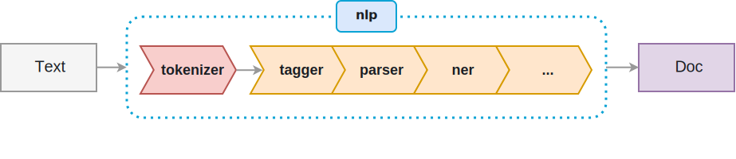

# Natural Language Processing (NLP)

spaCy is a free open-source library for Natural Language Processing (NLP) in Python, featuring NER, POS and more.

The name spaCy comes from spaces + Cython, as spaCy started off as a solution for tokenization - and potentially more. Cython allows spaCy to be incredibly fast.

It has trainable, or in other words customizable and extendable models for most of these tasks - while providing some really good models out of the box.


```python
%%svg
<svg class="o-svg" xmlns="http://www.w3.org/2000/svg" viewBox="0 0 923 200" width="923" height="200">
    <style>
        .svg__pipeline__text { fill: #1a1e23; font: 20px Arial, sans-serif }
        .svg__pipeline__text-small { fill: #1a1e23; font: bold 18px Arial, sans-serif }
        .svg__pipeline__text-code { fill: #1a1e23; font: 600 16px Menlo, Monaco, Consolas, "Liberation Mono", "Courier New", monospace }
    </style>
    <rect width="601" height="127" x="159" y="21" fill="none" stroke="#09a3d5" stroke-width="3" rx="19.1" stroke-dasharray="3 6" ry="19.1"/>
    <path fill="#e1d5e7" stroke="#9673a6" stroke-width="2" d="M801 55h120v60H801z"/>
    <text class="svg__pipeline__text" dy="0.75em" width="28" height="19" transform="translate(846.5 75.5)">Doc</text>
    <path fill="none" stroke="#999" stroke-width="2" stroke-miterlimit="10" d="M121.2 84.7h29.4"/>
    <path fill="#999" stroke="#999" stroke-width="2" stroke-miterlimit="10" d="M156.6 84.7l-8 4 2-4-2-4z"/>
    <path fill="#f5f5f5" stroke="#999" stroke-width="2" d="M1 55h120v60H1z"/>
    <text class="svg__pipeline__text" dy="0.85em" width="34" height="22" transform="translate(43.5 73.5)">Text</text>
    <path fill="none" stroke="#999" stroke-width="2" stroke-miterlimit="10" d="M760 84.7h33"/>
    <path fill="#999" stroke="#999" stroke-width="2" stroke-miterlimit="10" d="M799 84.7l-8 4 2-4-2-4z"/>
    <rect width="75" height="39" x="422" y="1" fill="#dae8fc" stroke="#09a3d5" stroke-width="2" rx="5.8" ry="5.8"/>
    <text class="svg__pipeline__text-code" dy="0.8em" dx="0.1em" width="29" height="17" transform="translate(444.5 11.5)">nlp</text>
    <path fill="#f8cecc" stroke="#b85450" stroke-width="2" stroke-miterlimit="10" d="M176 58h103.3L296 88l-16.8 30H176l16.8-30z"/>
    <text class="svg__pipeline__text-small" dy="0.75em" dx="-0.25em" width="58" height="14" transform="translate(206.5 80.5)">tokenizer</text>
    <path fill="#ffe6cc" stroke="#d79b00" stroke-width="2" stroke-miterlimit="10" d="M314 58h103.3L434 88l-16.8 30H314l16.8-30z"/>
    <text class="svg__pipeline__text-small" dy="0.75em" dx="8" width="62" height="14" transform="translate(342.5 80.5)">tagger</text>
    <path fill="none" stroke="#999" stroke-width="2" stroke-miterlimit="10" d="M296.5 88.2h24.7"/>
    <path fill="#999" stroke="#999" stroke-width="2" stroke-miterlimit="10" d="M327.2 88.2l-8 4 2-4-2-4z"/>
    <path fill="#ffe6cc" stroke="#d79b00" stroke-width="2" stroke-miterlimit="10" d="M416 58h103.3L536 88l-16.8 30H416l16.8-30z"/>
    <text class="svg__pipeline__text-small" dy="0.75em" dx="-0.25em" width="40" height="14" transform="translate(455.5 80.5)">parser</text>
    <path fill="#ffe6cc" stroke="#d79b00" stroke-width="2" stroke-miterlimit="10" d="M519 58h103.3L639 88l-16.8 30H519l16.8-30z"/>
    <text class="svg__pipeline__text-small" dy="0.75em" dx="8" width="40" height="14" transform="translate(558.5 80.5)">ner</text>
    <path fill="#ffe6cc" stroke="#d79b00" stroke-width="2" stroke-miterlimit="10" d="M622 58h103.3L742 88l-16.8 30H622l16.8-30z"/>
    <text class="svg__pipeline__text-small" dy="0.75em" dx="8" width="20" height="14" transform="translate(671.5 80.5)">...</text>
</svg>
```





```python
%%capture
import sys
!{sys.executable} -m pip install panda
!{sys.executable} -m pip install spacy
!{sys.executable} -m spacy download de
!{sys.executable} -m spacy download de_news_web_sm
!{sys.executable} -m spacy download en
!{sys.executable} -m spacy download en_core_web_sm
```

## 1. Vers im Alten Testament (deutsch) / Dependency Parsing


```python
import spacy

de_nlp = spacy.load('de')

de_doc = de_nlp(u'Am Anfang schuf Gott Himmel und Erde.')

spacy.displacy.render(de_doc, style='dep', jupyter=True)
```


<svg xmlns="http://www.w3.org/2000/svg" xmlns:xlink="http://www.w3.org/1999/xlink" id="0" class="displacy" width="1275" height="312.0" style="max-width: none; height: 312.0px; color: #000000; background: #ffffff; font-family: Arial">
<text class="displacy-token" fill="currentColor" text-anchor="middle" y="222.0">
    <tspan class="displacy-word" fill="currentColor" x="50">Am</tspan>
    <tspan class="displacy-tag" dy="2em" fill="currentColor" x="50">ADP</tspan>
</text>

<text class="displacy-token" fill="currentColor" text-anchor="middle" y="222.0">
    <tspan class="displacy-word" fill="currentColor" x="225">Anfang</tspan>
    <tspan class="displacy-tag" dy="2em" fill="currentColor" x="225">NOUN</tspan>
</text>

<text class="displacy-token" fill="currentColor" text-anchor="middle" y="222.0">
    <tspan class="displacy-word" fill="currentColor" x="400">schuf</tspan>
    <tspan class="displacy-tag" dy="2em" fill="currentColor" x="400">VERB</tspan>
</text>

<text class="displacy-token" fill="currentColor" text-anchor="middle" y="222.0">
    <tspan class="displacy-word" fill="currentColor" x="575">Gott</tspan>
    <tspan class="displacy-tag" dy="2em" fill="currentColor" x="575">NOUN</tspan>
</text>

<text class="displacy-token" fill="currentColor" text-anchor="middle" y="222.0">
    <tspan class="displacy-word" fill="currentColor" x="750">Himmel</tspan>
    <tspan class="displacy-tag" dy="2em" fill="currentColor" x="750">NOUN</tspan>
</text>

<text class="displacy-token" fill="currentColor" text-anchor="middle" y="222.0">
    <tspan class="displacy-word" fill="currentColor" x="925">und</tspan>
    <tspan class="displacy-tag" dy="2em" fill="currentColor" x="925">CONJ</tspan>
</text>

<text class="displacy-token" fill="currentColor" text-anchor="middle" y="222.0">
    <tspan class="displacy-word" fill="currentColor" x="1100">Erde.</tspan>
    <tspan class="displacy-tag" dy="2em" fill="currentColor" x="1100">NOUN</tspan>
</text>

<g class="displacy-arrow">
    <path class="displacy-arc" id="arrow-0-0" stroke-width="2px" d="M70,177.0 C70,2.0 400.0,2.0 400.0,177.0" fill="none" stroke="currentColor"/>
    <text dy="1.25em" style="font-size: 0.8em; letter-spacing: 1px">
        <textPath xlink:href="#arrow-0-0" class="displacy-label" startOffset="50%" fill="currentColor" text-anchor="middle">mo</textPath>
    </text>
    <path class="displacy-arrowhead" d="M70,179.0 L62,167.0 78,167.0" fill="currentColor"/>
</g>

<g class="displacy-arrow">
    <path class="displacy-arc" id="arrow-0-1" stroke-width="2px" d="M70,177.0 C70,89.5 220.0,89.5 220.0,177.0" fill="none" stroke="currentColor"/>
    <text dy="1.25em" style="font-size: 0.8em; letter-spacing: 1px">
        <textPath xlink:href="#arrow-0-1" class="displacy-label" startOffset="50%" fill="currentColor" text-anchor="middle">nk</textPath>
    </text>
    <path class="displacy-arrowhead" d="M220.0,179.0 L228.0,167.0 212.0,167.0" fill="currentColor"/>
</g>

<g class="displacy-arrow">
    <path class="displacy-arc" id="arrow-0-2" stroke-width="2px" d="M595,177.0 C595,89.5 745.0,89.5 745.0,177.0" fill="none" stroke="currentColor"/>
    <text dy="1.25em" style="font-size: 0.8em; letter-spacing: 1px">
        <textPath xlink:href="#arrow-0-2" class="displacy-label" startOffset="50%" fill="currentColor" text-anchor="middle">pnc</textPath>
    </text>
    <path class="displacy-arrowhead" d="M595,179.0 L587,167.0 603,167.0" fill="currentColor"/>
</g>

<g class="displacy-arrow">
    <path class="displacy-arc" id="arrow-0-3" stroke-width="2px" d="M420,177.0 C420,2.0 750.0,2.0 750.0,177.0" fill="none" stroke="currentColor"/>
    <text dy="1.25em" style="font-size: 0.8em; letter-spacing: 1px">
        <textPath xlink:href="#arrow-0-3" class="displacy-label" startOffset="50%" fill="currentColor" text-anchor="middle">sb</textPath>
    </text>
    <path class="displacy-arrowhead" d="M750.0,179.0 L758.0,167.0 742.0,167.0" fill="currentColor"/>
</g>

<g class="displacy-arrow">
    <path class="displacy-arc" id="arrow-0-4" stroke-width="2px" d="M770,177.0 C770,89.5 920.0,89.5 920.0,177.0" fill="none" stroke="currentColor"/>
    <text dy="1.25em" style="font-size: 0.8em; letter-spacing: 1px">
        <textPath xlink:href="#arrow-0-4" class="displacy-label" startOffset="50%" fill="currentColor" text-anchor="middle">cd</textPath>
    </text>
    <path class="displacy-arrowhead" d="M920.0,179.0 L928.0,167.0 912.0,167.0" fill="currentColor"/>
</g>

<g class="displacy-arrow">
    <path class="displacy-arc" id="arrow-0-5" stroke-width="2px" d="M945,177.0 C945,89.5 1095.0,89.5 1095.0,177.0" fill="none" stroke="currentColor"/>
    <text dy="1.25em" style="font-size: 0.8em; letter-spacing: 1px">
        <textPath xlink:href="#arrow-0-5" class="displacy-label" startOffset="50%" fill="currentColor" text-anchor="middle">cj</textPath>
    </text>
    <path class="displacy-arrowhead" d="M1095.0,179.0 L1103.0,167.0 1087.0,167.0" fill="currentColor"/>
</g>
</svg>


## 1. Vers im Alten Testament (deutsch) / Named Entity Recognition (NER)


```python
import spacy

de_nlp = spacy.load('de')

de_doc = de_nlp(u'Am Anfang schuf Gott Himmel und Erde.')

spacy.displacy.render(de_doc, style='ent', jupyter=True)
```


<div class="entities" style="line-height: 2.5">Am Anfang schuf Gott Himmel und 
<mark class="entity" style="background: #ff9561; padding: 0.45em 0.6em; margin: 0 0.25em; line-height: 1; border-radius: 0.35em; box-decoration-break: clone; -webkit-box-decoration-break: clone">
    Erde
    <span style="font-size: 0.8em; font-weight: bold; line-height: 1; border-radius: 0.35em; text-transform: uppercase; vertical-align: middle; margin-left: 0.5rem">LOC</span>
</mark>
.</div>


## Spacy / 1. Vers im Alten Testament (deutsch) / Lemmatization


```python
import pandas
import spacy
import tabulate

de_nlp = spacy.load('de')

de_doc = de_nlp(u'Am Anfang schuf Gott Himmel und Erde.')

df = pandas.DataFrame([[t.text, t.lemma_, t.pos_] for t in de_doc],columns=['text', 'lemma', 'pos'])

print(tabulate.tabulate(df, headers='keys', tablefmt='psql'))
```

    +----+--------+----------+-------+
    |    | text   | lemma    | pos   |
    |----+--------+----------+-------|
    |  0 | Am     | Am       | ADP   |
    |  1 | Anfang | Anfang   | NOUN  |
    |  2 | schuf  | schaffen | VERB  |
    |  3 | Gott   | Gott     | NOUN  |
    |  4 | Himmel | himmeln  | NOUN  |
    |  5 | und    | und      | CONJ  |
    |  6 | Erde   | erden    | NOUN  |
    |  7 | .      | .        | PUNCT |
    +----+--------+----------+-------+


## Spacy / Machinenbau (englisch) / Dependency Parsing


```python
import spacy

en_nlp = spacy.load('en_core_web_sm')

en_doc = en_nlp(u'\
Switchgear links generators, transporters, and consumers, such as motors and gears. \
')

options = {'compact': True, 'font': 'Source Sans Pro'}

spacy.displacy.render(en_doc, style='dep', options=options, jupyter=True)
```


<svg xmlns="http://www.w3.org/2000/svg" xmlns:xlink="http://www.w3.org/1999/xlink" id="0" class="displacy" width="1700" height="362.0" style="max-width: none; height: 362.0px; color: #000000; background: #ffffff; font-family: Source Sans Pro">
<text class="displacy-token" fill="currentColor" text-anchor="middle" y="272.0">
    <tspan class="displacy-word" fill="currentColor" x="50">Switchgear</tspan>
    <tspan class="displacy-tag" dy="2em" fill="currentColor" x="50">NOUN</tspan>
</text>

<text class="displacy-token" fill="currentColor" text-anchor="middle" y="272.0">
    <tspan class="displacy-word" fill="currentColor" x="200">links</tspan>
    <tspan class="displacy-tag" dy="2em" fill="currentColor" x="200">VERB</tspan>
</text>

<text class="displacy-token" fill="currentColor" text-anchor="middle" y="272.0">
    <tspan class="displacy-word" fill="currentColor" x="350">generators,</tspan>
    <tspan class="displacy-tag" dy="2em" fill="currentColor" x="350">NOUN</tspan>
</text>

<text class="displacy-token" fill="currentColor" text-anchor="middle" y="272.0">
    <tspan class="displacy-word" fill="currentColor" x="500">transporters,</tspan>
    <tspan class="displacy-tag" dy="2em" fill="currentColor" x="500">NOUN</tspan>
</text>

<text class="displacy-token" fill="currentColor" text-anchor="middle" y="272.0">
    <tspan class="displacy-word" fill="currentColor" x="650">and</tspan>
    <tspan class="displacy-tag" dy="2em" fill="currentColor" x="650">CCONJ</tspan>
</text>

<text class="displacy-token" fill="currentColor" text-anchor="middle" y="272.0">
    <tspan class="displacy-word" fill="currentColor" x="800">consumers,</tspan>
    <tspan class="displacy-tag" dy="2em" fill="currentColor" x="800">NOUN</tspan>
</text>

<text class="displacy-token" fill="currentColor" text-anchor="middle" y="272.0">
    <tspan class="displacy-word" fill="currentColor" x="950">such</tspan>
    <tspan class="displacy-tag" dy="2em" fill="currentColor" x="950">ADJ</tspan>
</text>

<text class="displacy-token" fill="currentColor" text-anchor="middle" y="272.0">
    <tspan class="displacy-word" fill="currentColor" x="1100">as</tspan>
    <tspan class="displacy-tag" dy="2em" fill="currentColor" x="1100">ADP</tspan>
</text>

<text class="displacy-token" fill="currentColor" text-anchor="middle" y="272.0">
    <tspan class="displacy-word" fill="currentColor" x="1250">motors</tspan>
    <tspan class="displacy-tag" dy="2em" fill="currentColor" x="1250">NOUN</tspan>
</text>

<text class="displacy-token" fill="currentColor" text-anchor="middle" y="272.0">
    <tspan class="displacy-word" fill="currentColor" x="1400">and</tspan>
    <tspan class="displacy-tag" dy="2em" fill="currentColor" x="1400">CCONJ</tspan>
</text>

<text class="displacy-token" fill="currentColor" text-anchor="middle" y="272.0">
    <tspan class="displacy-word" fill="currentColor" x="1550">gears.</tspan>
    <tspan class="displacy-tag" dy="2em" fill="currentColor" x="1550">NOUN</tspan>
</text>

<g class="displacy-arrow">
    <path class="displacy-arc" id="arrow-0-0" stroke-width="2px" d="M62,227.0 62,202.0 194.0,202.0 194.0,227.0" fill="none" stroke="currentColor"/>
    <text dy="1.25em" style="font-size: 0.8em; letter-spacing: 1px">
        <textPath xlink:href="#arrow-0-0" class="displacy-label" startOffset="50%" fill="currentColor" text-anchor="middle">amod</textPath>
    </text>
    <path class="displacy-arrowhead" d="M62,229.0 L58,221.0 66,221.0" fill="currentColor"/>
</g>

<g class="displacy-arrow">
    <path class="displacy-arc" id="arrow-0-1" stroke-width="2px" d="M212,227.0 212,202.0 344.0,202.0 344.0,227.0" fill="none" stroke="currentColor"/>
    <text dy="1.25em" style="font-size: 0.8em; letter-spacing: 1px">
        <textPath xlink:href="#arrow-0-1" class="displacy-label" startOffset="50%" fill="currentColor" text-anchor="middle">compound</textPath>
    </text>
    <path class="displacy-arrowhead" d="M212,229.0 L208,221.0 216,221.0" fill="currentColor"/>
</g>

<g class="displacy-arrow">
    <path class="displacy-arc" id="arrow-0-2" stroke-width="2px" d="M362,227.0 362,202.0 494.0,202.0 494.0,227.0" fill="none" stroke="currentColor"/>
    <text dy="1.25em" style="font-size: 0.8em; letter-spacing: 1px">
        <textPath xlink:href="#arrow-0-2" class="displacy-label" startOffset="50%" fill="currentColor" text-anchor="middle">conj</textPath>
    </text>
    <path class="displacy-arrowhead" d="M494.0,229.0 L498.0,221.0 490.0,221.0" fill="currentColor"/>
</g>

<g class="displacy-arrow">
    <path class="displacy-arc" id="arrow-0-3" stroke-width="2px" d="M512,227.0 512,202.0 644.0,202.0 644.0,227.0" fill="none" stroke="currentColor"/>
    <text dy="1.25em" style="font-size: 0.8em; letter-spacing: 1px">
        <textPath xlink:href="#arrow-0-3" class="displacy-label" startOffset="50%" fill="currentColor" text-anchor="middle">cc</textPath>
    </text>
    <path class="displacy-arrowhead" d="M644.0,229.0 L648.0,221.0 640.0,221.0" fill="currentColor"/>
</g>

<g class="displacy-arrow">
    <path class="displacy-arc" id="arrow-0-4" stroke-width="2px" d="M512,227.0 512,177.0 797.0,177.0 797.0,227.0" fill="none" stroke="currentColor"/>
    <text dy="1.25em" style="font-size: 0.8em; letter-spacing: 1px">
        <textPath xlink:href="#arrow-0-4" class="displacy-label" startOffset="50%" fill="currentColor" text-anchor="middle">conj</textPath>
    </text>
    <path class="displacy-arrowhead" d="M797.0,229.0 L801.0,221.0 793.0,221.0" fill="currentColor"/>
</g>

<g class="displacy-arrow">
    <path class="displacy-arc" id="arrow-0-5" stroke-width="2px" d="M962,227.0 962,202.0 1094.0,202.0 1094.0,227.0" fill="none" stroke="currentColor"/>
    <text dy="1.25em" style="font-size: 0.8em; letter-spacing: 1px">
        <textPath xlink:href="#arrow-0-5" class="displacy-label" startOffset="50%" fill="currentColor" text-anchor="middle">amod</textPath>
    </text>
    <path class="displacy-arrowhead" d="M962,229.0 L958,221.0 966,221.0" fill="currentColor"/>
</g>

<g class="displacy-arrow">
    <path class="displacy-arc" id="arrow-0-6" stroke-width="2px" d="M362,227.0 362,152.0 1100.0,152.0 1100.0,227.0" fill="none" stroke="currentColor"/>
    <text dy="1.25em" style="font-size: 0.8em; letter-spacing: 1px">
        <textPath xlink:href="#arrow-0-6" class="displacy-label" startOffset="50%" fill="currentColor" text-anchor="middle">prep</textPath>
    </text>
    <path class="displacy-arrowhead" d="M1100.0,229.0 L1104.0,221.0 1096.0,221.0" fill="currentColor"/>
</g>

<g class="displacy-arrow">
    <path class="displacy-arc" id="arrow-0-7" stroke-width="2px" d="M1112,227.0 1112,202.0 1244.0,202.0 1244.0,227.0" fill="none" stroke="currentColor"/>
    <text dy="1.25em" style="font-size: 0.8em; letter-spacing: 1px">
        <textPath xlink:href="#arrow-0-7" class="displacy-label" startOffset="50%" fill="currentColor" text-anchor="middle">pobj</textPath>
    </text>
    <path class="displacy-arrowhead" d="M1244.0,229.0 L1248.0,221.0 1240.0,221.0" fill="currentColor"/>
</g>

<g class="displacy-arrow">
    <path class="displacy-arc" id="arrow-0-8" stroke-width="2px" d="M1262,227.0 1262,202.0 1394.0,202.0 1394.0,227.0" fill="none" stroke="currentColor"/>
    <text dy="1.25em" style="font-size: 0.8em; letter-spacing: 1px">
        <textPath xlink:href="#arrow-0-8" class="displacy-label" startOffset="50%" fill="currentColor" text-anchor="middle">cc</textPath>
    </text>
    <path class="displacy-arrowhead" d="M1394.0,229.0 L1398.0,221.0 1390.0,221.0" fill="currentColor"/>
</g>

<g class="displacy-arrow">
    <path class="displacy-arc" id="arrow-0-9" stroke-width="2px" d="M1262,227.0 1262,177.0 1547.0,177.0 1547.0,227.0" fill="none" stroke="currentColor"/>
    <text dy="1.25em" style="font-size: 0.8em; letter-spacing: 1px">
        <textPath xlink:href="#arrow-0-9" class="displacy-label" startOffset="50%" fill="currentColor" text-anchor="middle">conj</textPath>
    </text>
    <path class="displacy-arrowhead" d="M1547.0,229.0 L1551.0,221.0 1543.0,221.0" fill="currentColor"/>
</g>
</svg>


```python
import pandas
import tabulate

df = pandas.DataFrame(
    [[t.text, t.lemma_, t.pos_, t.is_stop] for t in en_doc],
    columns=['text', 'lemma', 'pos', 'stop'])

print(tabulate.tabulate(df, headers='keys', tablefmt='psql'))
```

    +----+--------------+-------------+-------+--------+
    |    | text         | lemma       | pos   | stop   |
    |----+--------------+-------------+-------+--------|
    |  0 | Switchgear   | switchgear  | NOUN  | False  |
    |  1 | links        | link        | VERB  | False  |
    |  2 | generators   | generator   | NOUN  | False  |
    |  3 | ,            | ,           | PUNCT | False  |
    |  4 | transporters | transporter | NOUN  | False  |
    |  5 | ,            | ,           | PUNCT | False  |
    |  6 | and          | and         | CCONJ | True   |
    |  7 | consumers    | consumer    | NOUN  | False  |
    |  8 | ,            | ,           | PUNCT | False  |
    |  9 | such         | such        | ADJ   | True   |
    | 10 | as           | as          | ADP   | True   |
    | 11 | motors       | motor       | NOUN  | False  |
    | 12 | and          | and         | CCONJ | True   |
    | 13 | gears        | gear        | NOUN  | False  |
    | 14 | .            | .           | PUNCT | False  |
    +----+--------------+-------------+-------+--------+


```python
import spacy

nlp = spacy.load('en_core_web_sm')

doc = nlp(u'Switchgear links generators, transporters, and consumers, such as motors and gears.')

for sent in doc.sents:
    pos = {
        'text':  sent.text,
        'ents':  [{'start': token.idx,'end': token.idx+len(token), 'label': token.pos_} for token in sent],
        'title': None
    }

spacy.displacy.render(pos, style='ent', manual=True, jupyter=True)
```


<div class="entities" style="line-height: 2.5">
<mark class="entity" style="background: #ddd; padding: 0.45em 0.6em; margin: 0 0.25em; line-height: 1; border-radius: 0.35em; box-decoration-break: clone; -webkit-box-decoration-break: clone">
    Switchgear
    <span style="font-size: 0.8em; font-weight: bold; line-height: 1; border-radius: 0.35em; text-transform: uppercase; vertical-align: middle; margin-left: 0.5rem">NOUN</span>
</mark>
 
<mark class="entity" style="background: #ddd; padding: 0.45em 0.6em; margin: 0 0.25em; line-height: 1; border-radius: 0.35em; box-decoration-break: clone; -webkit-box-decoration-break: clone">
    links
    <span style="font-size: 0.8em; font-weight: bold; line-height: 1; border-radius: 0.35em; text-transform: uppercase; vertical-align: middle; margin-left: 0.5rem">VERB</span>
</mark>
 
<mark class="entity" style="background: #ddd; padding: 0.45em 0.6em; margin: 0 0.25em; line-height: 1; border-radius: 0.35em; box-decoration-break: clone; -webkit-box-decoration-break: clone">
    generators
    <span style="font-size: 0.8em; font-weight: bold; line-height: 1; border-radius: 0.35em; text-transform: uppercase; vertical-align: middle; margin-left: 0.5rem">NOUN</span>
</mark>

<mark class="entity" style="background: #ddd; padding: 0.45em 0.6em; margin: 0 0.25em; line-height: 1; border-radius: 0.35em; box-decoration-break: clone; -webkit-box-decoration-break: clone">
    ,
    <span style="font-size: 0.8em; font-weight: bold; line-height: 1; border-radius: 0.35em; text-transform: uppercase; vertical-align: middle; margin-left: 0.5rem">PUNCT</span>
</mark>
 
<mark class="entity" style="background: #ddd; padding: 0.45em 0.6em; margin: 0 0.25em; line-height: 1; border-radius: 0.35em; box-decoration-break: clone; -webkit-box-decoration-break: clone">
    transporters
    <span style="font-size: 0.8em; font-weight: bold; line-height: 1; border-radius: 0.35em; text-transform: uppercase; vertical-align: middle; margin-left: 0.5rem">NOUN</span>
</mark>

<mark class="entity" style="background: #ddd; padding: 0.45em 0.6em; margin: 0 0.25em; line-height: 1; border-radius: 0.35em; box-decoration-break: clone; -webkit-box-decoration-break: clone">
    ,
    <span style="font-size: 0.8em; font-weight: bold; line-height: 1; border-radius: 0.35em; text-transform: uppercase; vertical-align: middle; margin-left: 0.5rem">PUNCT</span>
</mark>
 
<mark class="entity" style="background: #ddd; padding: 0.45em 0.6em; margin: 0 0.25em; line-height: 1; border-radius: 0.35em; box-decoration-break: clone; -webkit-box-decoration-break: clone">
    and
    <span style="font-size: 0.8em; font-weight: bold; line-height: 1; border-radius: 0.35em; text-transform: uppercase; vertical-align: middle; margin-left: 0.5rem">CCONJ</span>
</mark>
 
<mark class="entity" style="background: #ddd; padding: 0.45em 0.6em; margin: 0 0.25em; line-height: 1; border-radius: 0.35em; box-decoration-break: clone; -webkit-box-decoration-break: clone">
    consumers
    <span style="font-size: 0.8em; font-weight: bold; line-height: 1; border-radius: 0.35em; text-transform: uppercase; vertical-align: middle; margin-left: 0.5rem">NOUN</span>
</mark>

<mark class="entity" style="background: #ddd; padding: 0.45em 0.6em; margin: 0 0.25em; line-height: 1; border-radius: 0.35em; box-decoration-break: clone; -webkit-box-decoration-break: clone">
    ,
    <span style="font-size: 0.8em; font-weight: bold; line-height: 1; border-radius: 0.35em; text-transform: uppercase; vertical-align: middle; margin-left: 0.5rem">PUNCT</span>
</mark>
 
<mark class="entity" style="background: #ddd; padding: 0.45em 0.6em; margin: 0 0.25em; line-height: 1; border-radius: 0.35em; box-decoration-break: clone; -webkit-box-decoration-break: clone">
    such
    <span style="font-size: 0.8em; font-weight: bold; line-height: 1; border-radius: 0.35em; text-transform: uppercase; vertical-align: middle; margin-left: 0.5rem">ADJ</span>
</mark>
 
<mark class="entity" style="background: #ddd; padding: 0.45em 0.6em; margin: 0 0.25em; line-height: 1; border-radius: 0.35em; box-decoration-break: clone; -webkit-box-decoration-break: clone">
    as
    <span style="font-size: 0.8em; font-weight: bold; line-height: 1; border-radius: 0.35em; text-transform: uppercase; vertical-align: middle; margin-left: 0.5rem">ADP</span>
</mark>
 
<mark class="entity" style="background: #ddd; padding: 0.45em 0.6em; margin: 0 0.25em; line-height: 1; border-radius: 0.35em; box-decoration-break: clone; -webkit-box-decoration-break: clone">
    motors
    <span style="font-size: 0.8em; font-weight: bold; line-height: 1; border-radius: 0.35em; text-transform: uppercase; vertical-align: middle; margin-left: 0.5rem">NOUN</span>
</mark>
 
<mark class="entity" style="background: #ddd; padding: 0.45em 0.6em; margin: 0 0.25em; line-height: 1; border-radius: 0.35em; box-decoration-break: clone; -webkit-box-decoration-break: clone">
    and
    <span style="font-size: 0.8em; font-weight: bold; line-height: 1; border-radius: 0.35em; text-transform: uppercase; vertical-align: middle; margin-left: 0.5rem">CCONJ</span>
</mark>
 
<mark class="entity" style="background: #ddd; padding: 0.45em 0.6em; margin: 0 0.25em; line-height: 1; border-radius: 0.35em; box-decoration-break: clone; -webkit-box-decoration-break: clone">
    gears
    <span style="font-size: 0.8em; font-weight: bold; line-height: 1; border-radius: 0.35em; text-transform: uppercase; vertical-align: middle; margin-left: 0.5rem">NOUN</span>
</mark>

<mark class="entity" style="background: #ddd; padding: 0.45em 0.6em; margin: 0 0.25em; line-height: 1; border-radius: 0.35em; box-decoration-break: clone; -webkit-box-decoration-break: clone">
    .
    <span style="font-size: 0.8em; font-weight: bold; line-height: 1; border-radius: 0.35em; text-transform: uppercase; vertical-align: middle; margin-left: 0.5rem">PUNCT</span>
</mark>
</div>

